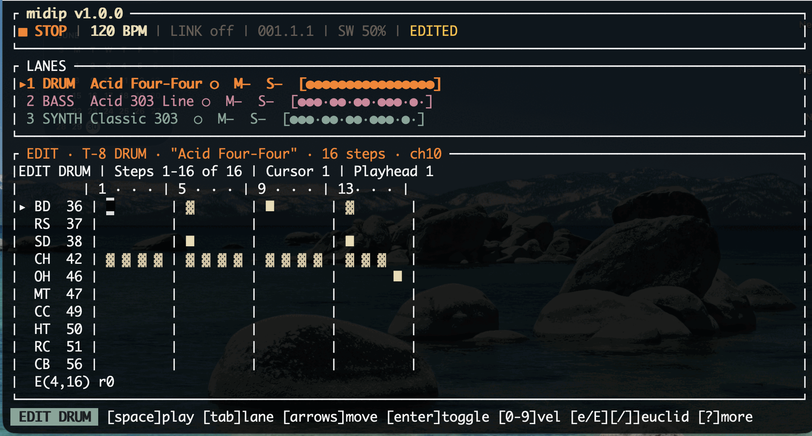

<div align="center">

# midip

**A terminal MIDI sequencer & live groovebox — built‑in profiles for the Roland AIRA Compact T‑8 & S‑1, plus a device library for any class‑compliant USB‑MIDI gear**

[](LICENSE)
[](CHANGELOG.md)
[](https://www.rust-lang.org)
[](CHANGELOG.md)
[](#build--run)
[](https://ratatui.rs)



</div>

```
▶ PLAY  124 BPM  LINK 2 LOCKED  001.2.3  SW 56%  SAVED
▸1 DRUM   techno #03   ●  M– S–  [●···●···●···●···]        ACTIVE
 2 BASS   acid #11     ●  M– S–  [●··●····●··●····]        QUEUED⟶
 3 SYNTH  dub #07      ○  M– S–  [··●····●····●···]
EDIT DRUM | Steps 1-16 of 16 | Cursor 1 | Playhead 4
 ... step grid ...
Step 1 · BD · Velocity 120 [-/+] · Probability 100% [p/P] · Ratchet x1 [y/Y]
[space]play [tab]lane [arrows]move [enter]toggle [0-9]vel [?]controls
```

midip is **MIDI‑only**: it makes *your* devices play the notes. It is the sequencer; your
gear is the sound. (It never triggers a device's own internal pattern — see
[Devices & MIDI](#devices--midi).)

📄 **[Printable cheat sheet (PDF)](midip-cheatsheet.pdf)** — every keybinding on a single page.

---

## Table of contents

- [Features](#features)
- [Requirements](#requirements)
- [Build & run](#build--run)
- [Quick start](#quick-start)
- [The interface](#the-interface)
- [Controls](#controls)
- [Devices & MIDI](#devices--midi)
- [Tempo & Ableton Link](#tempo--ableton-link)
- [Patterns, library & sets](#patterns-library--sets)
- [Favorites & crates](#favorites--crates)
- [Performance controls](#performance-controls)
- [Scale-aware editing](#scale-aware-editing)
- [Scenes](#scenes)
- [Song mode (chains)](#song-mode-chains)
- [Generative tools](#generative-tools)
- [Per-step CC, microtiming & trig conditions](#per-step-cc-microtiming--trig-conditions)
- [MIDI clock input](#midi-clock-input)
- [Configuration](#configuration)
- [Project layout](#project-layout)
- [Testing](#testing)
- [Status](#status)
- [License](#license)

---

## Features

- **Device library & picker** — built‑in profiles for the AIRA Compact T‑8/S‑1/J‑6, Behringer
  RD‑8 & TD‑3, Arturia DrumBrute Impact & MicroFreak, Korg monologue & minilogue xd, Elektron
  Digitakt and Novation Circuit Tracks, plus generic GM‑drum/mono/poly fallbacks. Press `d` to
  swap any device onto a lane (filtered to the lane's kind); add your own via `devices.json`.
- **3‑lane groovebox** — T‑8 drums + T‑8 bass + S‑1 synth play together, each with its own
  pattern, with **polymeter** (lanes can have different lengths and drift in and out of phase).
- **Built‑in library** — hundreds of named patterns across 20 genres (a vendored snapshot of
  the [mpump](https://github.com/gdamdam) pattern set), browsable with **audible audition**
  (cue a pattern before committing it — gated to stopped or muted lanes so it never collides
  with a live lane).
- **Full step authoring** — toggle hits, velocity, note entry, per‑note length, slides (303/
  SH‑1 style), per‑step **probability** and **ratcheting**, **Euclidean** generation,
  copy/paste/rotate, pattern length 1–64, **double‑length** (`L`), and global undo/redo.
- **Quantized pattern launching** — loading a pattern while playing queues it and launches it
  exactly at the next bar or next beat (toggle with `b`), restarting the lane at step 1 without
  disrupting the others. Lanes show `ACTIVE` and `QUEUED⟶` markers; `C` cancels a queue.
- **Configurable per‑lane MIDI routing** — assign each lane its own output port, MIDI channel,
  and clock‑out flag via the route editor (`w`).
- **Virtual `midip` port** — a routable virtual MIDI source that other apps on the same machine
  can subscribe to. Route any lane directly to "midip" in the route editor, or use `M` to mirror
  the full output stream to it. The port appears as `midip` in any DAW or app.
- **Favorites & crates** — star patterns (`f`), filter to favorites (`F`), and collect them into
  named **crates** for set-based performance. The **live crate view** (`V`) lets you browse and
  launch patterns mid-performance, quantized and role-matched (drums→drum lane, etc.).
- **Performance controls** — mute individual drum voices live (backtick `` ` ``), restart a
  drifted lane's phase without changing its pattern (`i`), and overlay a temporary fill (`f`/`F`)
  that reverts cleanly if not committed.
- **Scale-aware melodic editing** — choose a root + scale per melodic lane (`n`/`N` scale,
  `h`/`H` root); `↑`/`↓` moves by scale degree; `X` conforms existing notes to the scale;
  `I` opens a QWERTY piano note-input sub-mode.
- **Chords & polyphony** — the S‑1 synth lane is polyphonic: a step can hold several notes.
  Stack notes by key in the note-input sub-mode, build a scale-aware triad with `j`, or strip
  a note with `J`. The T‑8 bass stays monophonic (single note + slide). Backward-compatible:
  every existing pattern loads and plays exactly as before.
- **Scenes** — capture the current per-lane state (pattern + mute/solo/transpose/octave) as a
  named scene, then recall it live as a **quantized all-lane launch on one boundary** — all
  lanes switch together on the next bar/beat. The scene manager (`G`) handles capture, recall,
  rename, duplicate, delete, and validation. Scenes live in the set file (backward-compatible).
- **Song mode / chaining** — build ordered **chains** of scenes (`K`): each entry dwells for a
  set number of bars × repeats, then auto-launches the next scene on a bar boundary. Chains can
  loop, stop at the end, or be jumped live (`j`). Multiple named chains per set.
- **Generative tools** (`D`) — generate a fresh pattern from density/range/seed, or **vary**
  (mutate) the current one. Seeded and reproducible; pitches fold to the lane's scale. Previews
  live, commits as a single undo on Enter or reverts on Esc.
- **Per-step CC locks, microtiming & trig conditions** — lock CC values to individual steps;
  nudge note timing earlier/later within the step (`\`/`|`); and set **trig conditions** (`z`:
  Always / 1:2 / 1:3 / 1:4 / Fill / !Fill / 1st / !1st). A latched fill toggle drives Fill
  conditions. Also: per-lane **swing override** (`a`/`_`) and **clock division** (`Q`, /1–/4).
- **MIDI clock input** (`W`) — follow an external 24-PPQN clock as a slave. The transport header
  shows `CLK-IN <port> [LOCKED|FREE|LOST]`; Start/Continue/Stop are obeyed; clock-loss stops
  cleanly. midip's first MIDI input path.
- **Ember theme** — a warm, cozy dark palette (cream on warm-dark, orange/pink/aqua accents);
  fully static, no flashing, degrades to monochrome. Version shown in the transport header.
- **Tempo** — type an exact BPM, nudge it, **tap tempo**, or sync to **Ableton Link**
  (embedded — no separate bridge app). Link bar‑locks playback start so no notes fire before
  the bar boundary. midip is the clock master (24 PPQN).
- **Auto‑detects** your T‑8 / S‑1 by name, with live connection status and basic hot‑plug.
- **Persistence** — versioned + atomic saves, stable set IDs, **autosave + crash recovery**
  (startup offers Recover / Discard / Open on an unclean shutdown). Full set management:
  save‑as, rename, duplicate, new, and delete. Save the focused lane as a user pattern (`A`),
  clear it (`Z`), and load user patterns from a "User" section in the library.
- Tasteful static color, a context‑sensitive footer, and a full scrollable two-column `?` controls overlay.

## Requirements

- **Rust** (stable, 2021 edition) — install via [rustup](https://rustup.rs).
- A **terminal** at least **60×16** (it shows a resize hint if smaller).
- **MIDI**: macOS (CoreMIDI) or any platform [`midir`](https://crates.io/crates/midir)
  supports. The first build downloads crates from crates.io.
- **Hardware** is optional — without any device connected, midip still runs (silently) so you
  can browse and edit.

## Build & run

```sh
git clone <this-repo> midip && cd midip
cargo run --release          # launches the terminal UI
```

Other commands:

```sh
cargo build --release        # just build the binary (target/release/midip)
cargo test                   # run the test suite (1010 tests, no hardware needed)
```

> Run it in a real terminal (not piped) — it takes over the screen while running and restores
> it on exit. Press `?` any time for the full control list, `q` (twice while playing) to quit.

## Quick start

1. Plug in your **T‑8** and/or **S‑1** over USB and start midip — connected lanes show `●`.
2. Press **`l`** to open the **library**. Use **←/→** to switch the genre / pattern columns
   and **↑/↓** to move within a list. Press **`a`** to **audition** the selected pattern (only
   available when the focused lane is stopped or muted); keep auditioning as you scroll, then
   **Enter** to keep it or **Esc** to revert.
3. Press **space** to play. Set the tempo with **`t`** (type a BPM) or **`T`** (tap), or press
   **`k`** to follow an **Ableton Link** session.
4. While playing, press **`l`** and hit **Enter** on a new pattern — it queues and launches on
   the next bar without stopping the other lanes.
5. Switch lanes with **Tab**, edit the grid, and **`s`** to save the set.

## The interface

- **Transport bar** — play state · BPM · Link (peers + `LOCKED`) · `bar.beat.16th` · swing ·
  `SAVED`/`EDITED`, with a status/toast line beneath it ("Saved", "Loaded dub #07",
  "Velocity 96", "Link lost", …).
- **Lanes** — one row each for `DRUM` / `BASS` / `SYNTH`: focus marker, pattern name,
  connection `●/○`, mute/solo (`M●`/`S●`), mirror indicator (`MIR`), a live activity strip,
  and `ACTIVE` / `QUEUED⟶` launch markers when queuing is in play.
- **Editor** — adapts to the focused lane:
  - **Drums**: a TR‑style grid (voice rows × steps); velocity shown as cell shading.
  - **Melodic**: a note lane with pitch names, note length (sustain spans cells), and slides
    drawn as a glide tie between notes. Scale degree shown when a scale is active.
  - Shows an `EDIT … | Steps x‑y of N | Cursor | Playhead` header and a per‑step detail line.
  - Patterns longer than 16 steps **page** (the view follows the cursor).
- **Library** overlay (`l`) — genre column + pattern column; `a` to audition, Enter to commit,
  `f`/`F` for favorites, `b` toggle launch quant.
- **Set manager** overlay (`o`) — load, save‑as, rename, duplicate, new, delete.
- **Route editor** overlay (`w`) — per‑lane port / channel / clock‑out assignment.
- **Live crate view** overlay (`V`) — browse crates and launch patterns quantized to role-matched lanes.

## Controls

Press **`?`** in‑app for the full scrollable two-column list. `space` and `!` work in every mode.

### Transport

| Key | Action |
|-----|--------|
| `space` | Play / stop |
| `esc` | Panic — all notes off (transport keeps running) |
| `!` | Full MIDI panic |
| `t` | Type BPM (Enter confirm, Esc cancel) |
| `;` / `'` | BPM −1 / +1 |
| `T` | Tap tempo |
| `k` | Toggle Ableton Link |
| `<` / `>` | Swing − / + |
| `{` / `}` | Pattern length − / + |
| `L` | Double length (repeats content, max 64) |

### Edit (both lane types)

| Key | Action |
|-----|--------|
| `tab` / `shift+tab` | Cycle lane focus next / prev |
| `enter` | Toggle step (Drums) / place note (Melodic) |
| `0–9` | Velocity bucket |
| `+` / `-` | Fine velocity |
| `p` / `P` | Step probability up / down |
| `y` / `Y` | Ratchet up / down |
| `x` `c` `v` | Cut / copy / paste |
| `r` / `R` | Rotate |
| `del` | Clear step |
| `\` / `|` | Microtiming nudge earlier / later (clamped to ±½ step) |
| `z` | Cycle trig condition (Always / 1:2 / 1:3 / 1:4 / Fill / !Fill / 1st / !1st) |
| `a` / `_` | Lane swing override down / up |
| `Q` | Cycle lane clock division (/1 /2 /3 /4) |

### Drums

| Key | Action |
|-----|--------|
| `←` `→` `↑` `↓` | Move cursor |
| `e` / `E` | Euclidean pulses add / remove |
| `[` / `]` | Euclidean rotation |
| `` ` `` | Toggle mute on focused drum voice (latched, non-destructive) |
| `i` | Quantized lane restart (re-sync phase at next bar/beat) |
| `f` | Temporary fill — toggle overlay on/off (reverts on lane focus change) |
| `F` | Commit fill as a permanent (undoable) edit |

### Melodic

| Key | Action |
|-----|--------|
| `←` / `→` | Step cursor |
| `↑` / `↓` | Pitch up / down (by scale degree when scale is set) |
| `g` | Toggle slide |
| `,` / `.` | Note length |
| `[` / `]` | Octave down / up |
| `n` / `N` | Cycle scale forward / backward |
| `h` / `H` | Root note down / up (semitone) |
| `X` | Conform all existing notes to current scale (with undo) |
| `I` | Note-input sub-mode (QWERTY piano; Esc to exit) |
| `j` | Build a scale-aware triad on the step (poly lanes) |
| `J` | Remove the last note of a chord |
| `i` | Quantized lane restart |

### Library (`l` to open)

| Key | Action |
|-----|--------|
| `←` / `→` | Switch column (genre / pattern) |
| `↑` / `↓` | Select |
| `a` | Audition (preview; lane must be stopped or muted) |
| `enter` | Commit pattern (queues at next bar/beat when playing) |
| `b` | Toggle launch quantization: next bar / next beat |
| `C` | Cancel pending queued launch |
| `f` | Toggle favorite on selected pattern |
| `F` | Toggle favorites-only filter |
| `esc` / `l` | Close library |

### Live Crate View (`V` to open)

| Key | Action |
|-----|--------|
| `↑` / `↓` | Select entry (never changes playback) |
| `←` / `→` | Switch crate |
| `enter` | Launch selected pattern (quantized, role-matched) |
| `a` | Audition selected pattern (gated) |
| `f` | Toggle favorite |
| `C` | Cancel pending queued launch |
| `z` | Pre-performance validation (report missing/unavailable) |
| `esc` | Close crate view |

### Set Manager (`o` to open)

| Key | Action |
|-----|--------|
| `↑` / `↓` | Select set |
| `enter` | Load set |
| `r` | Rename set |
| `a` / `S` | Save as new |
| `D` | Duplicate |
| `d` | Delete (with confirmation) |
| `n` | New set (confirms if unsaved) |
| `esc` / `o` | Close |

### Route Editor (`w` to open)

| Key | Action |
|-----|--------|
| `↑` / `↓` | Select lane |
| `←` / `→` | Move between fields (Port / Channel / Clock-out) |
| `c` / `C` | Cycle port forward / backward |
| `[` / `]` | Channel −1 / +1 (1‑based, range 1–16) |
| `z` | Toggle MIDI clock output on/off for the lane |
| `esc` | Close route editor |

### Scene Manager (`G` to open)

| Key | Action |
|-----|--------|
| `↑` / `↓` | Select a scene |
| `c` | Capture current state as a new scene |
| `Enter` | Recall selected scene (quantized all-lane launch) |
| `r` / `d` | Rename / duplicate |
| `x` / `Del` | Delete (with confirmation) |
| `z` | Validate — flag assignments whose pattern is missing |
| `C` | Cancel a queued recall |
| `G` / `Esc` | Close |

### Chain Manager (`K` to open)

| Key | Action |
|-----|--------|
| `↑` / `↓` | Select chain or entry |
| `c` | Create new chain |
| `r` | Rename selected chain |
| `d` | Duplicate chain |
| `x` | Delete chain |
| `a` | Add focused scene as a chain entry |
| `Tab` | Navigate entries |
| `[` / `]` | Entry bars −1 / +1 |
| `{` / `}` | Entry repeats −1 / +1 |
| `m` | Toggle chain loop |
| `Enter` | Play selected chain (starts transport) |
| `C` | Stop chain |
| `j` | Jump live to selected entry |
| `K` / `Esc` | Close |

### Generative Panel (`D` to open)

| Key | Action |
|-----|--------|
| `Tab` / `Shift+Tab` | Switch between Generate / Vary |
| `d` | Adjust density |
| `r` | Adjust range |
| `m` | Adjust mutation amount |
| `z` | Reroll seed |
| `Enter` | Commit as single undo step |
| `Esc` | Revert |

### Global

| Key | Action |
|-----|--------|
| `ctrl+z` / `u` | Undo |
| `ctrl+y` | Redo |
| `m` | Mute focused lane |
| `S` | Solo focused lane |
| `M` | Toggle virtual mirror output (`MIR` indicator) |
| `A` | Save focused lane as user pattern |
| `Z` | Clear focused lane pattern (with confirmation) |
| `b` | Toggle launch quantization: next bar / next beat |
| `C` | Cancel pending queued launch |
| `w` | Open route editor |
| `l` | Open library |
| `V` | Open live crate view |
| `G` | Open scene manager |
| `K` | Open chain manager (song mode) |
| `D` | Open generative panel |
| `W` | Select MIDI clock-in port |
| `o` | Open set manager |
| `s` | Save set |
| `?` | Help overlay |
| `q` | Quit (press twice while playing) |

## Devices & MIDI

A fresh set opens as three lanes matching the AIRA Compacts, each auto‑detected by port name:

| Lane | Device | MIDI channel |
|------|--------|--------------|
| DRUM | T‑8 (drum part) | 10 |
| BASS | T‑8 (bass part) | 2 |
| SYNTH | S‑1 | 1 |

The two T‑8 lanes share one physical connection (distinguished by channel).

### Device library & picker (`d`)

midip is not limited to the AIRA Compacts. Press **`d`** on any lane to open the **device
picker** and swap in another instrument — the list is filtered to the lane's kind (drum lanes
show drum machines, melodic lanes show synths) so the pattern stays valid, and the lane
re‑routes to the new device's port and default channel automatically.

Built‑in profiles (note maps sourced from each device's MIDI implementation chart; channel and
port stay adjustable per lane):

| Kind | Devices |
|------|---------|
| Drums | T‑8 · Behringer RD‑8 · Arturia DrumBrute Impact · Novation Circuit (drums) · **Generic GM drums** |
| Synth | S‑1 · Roland J‑6 · Behringer TD‑3 · Korg monologue · Arturia MicroFreak · Korg minilogue xd · Elektron Digitakt · Novation Circuit (synth) · **Generic mono / poly** |

The generic profiles drive *any* class‑compliant USB‑MIDI device immediately — pick a generic,
then set its port/channel in the route editor. To ship named profiles of your own, drop a
`devices.json` in the data dir (same schema as [`assets/devices/catalog.json`](assets/devices/catalog.json));
your entries layer on top of the built‑in catalog. Any lane's port, channel, and clock‑out
remain adjustable in the **route editor** (`w`).

midip sends **MIDI Clock** (24 PPQN, so the devices' delays/arps follow its tempo) but **not**
transport Start/Stop — so your gear plays *only* the notes midip sends, never its own stored
pattern. A failed send or unplugged device flips that lane to `○`; replugging reconnects
automatically.

### Virtual `midip` port

From v0.7.0 the virtual MIDI source is a **first-class routable destination**. In the route
editor (`w`), select "midip" as any lane's output port — that lane's MIDI goes straight to the
virtual source (shown as `CON ●`), available to any DAW or app on the machine. `M` still
mirrors the full output stream additively; it does not double-send a lane already routed to
"midip". The hardware path is unaffected in all cases.

## Tempo & Ableton Link

- **Manual**: `t` to type an exact BPM (20–300), `;`/`'` to nudge ±1, `T` to tap.
- **Ableton Link**: `k` toggles Link. When enabled, midip phase‑locks to the session tempo and
  shows `LINK <peers> LOCKED`. Playback start is **bar‑locked**: pressing play arms the engine
  and the first note fires only at the next bar boundary — no early notes. Link is embedded
  directly (via `rusty_link`) — no companion app required.

## Patterns, library & sets

- The library lives in `assets/patterns/` (`patterns-t8-drums.json`, `patterns-t8-bass.json`,
  `patterns-s1.json`, `catalog.json`) — a **read‑only vendored snapshot** of the mpump set,
  never modified at runtime. Genres are listed alphabetically; each pattern has a name and
  description from the catalog.
- **Audition** (`a`) previews a library pattern without committing (only when the lane is
  stopped or muted); focus change or Esc reverts. **Enter** commits.
- **Quantized launch**: committing a pattern while playing queues it (`QUEUED⟶`) for the next
  bar or beat (toggle `b`). `C` cancels.
- **User patterns**: `A` saves the focused lane as a named user pattern; `Z` clears it. User
  patterns appear in the library under a "User" section and can be renamed, duplicated, or
  deleted from there.
- **Sets** hold all three lanes + tempo/swing. Set files are named `<name>-<id>.json` (stable
  IDs prevent silent overwrites). The format is versioned; old files upgrade automatically; a
  file from a newer midip is rejected cleanly.
- **Autosave** writes a recovery file in the background (never overwrites a deliberate save).
  On an **unclean shutdown**, startup prompts **Recover / Discard / Open** saved.
- **Set management** (`o`): save‑as, rename, duplicate, new, and delete with confirmation.

## Favorites & crates

- **Favorite patterns** — star any vendored or user pattern in the library with `f`; filter
  to favorites-only with `F`. Favorites persist across runs.
- **Crates** — named, ordered, reusable collections of pattern references. Create, rename,
  duplicate, delete, and reorder entries; a pattern can live in multiple crates.
- **Live crate view** (`V`) — browse crates and launch patterns live without touching the
  library. `Enter` launches the selected entry **quantized** to the **role-matched lane**
  (drums→drum lane, bass→bass, synth→synth). `a` auditions (gated), `←/→` switches crates,
  `f` favorites, `C` cancels a queued launch.
- **Pre-performance validation** (`z` in the crate view) — reports entries whose pattern is
  missing or whose target lane's device is unavailable before a set.

## Performance controls

Available in Edit mode (v0.7.0+):

- **Per-drum-voice mute** (backtick `` ` ``) — mute a single drum voice (e.g. just the hi-hat)
  live, latched and non-destructive. Muting releases the voice's sounding note immediately.
- **Quantized lane restart** (`i`) — re-sync a drifted lane by restarting its phase at the
  next bar or beat boundary, without changing its pattern.
- **Temporary fill** (`f` / `F`) — overlay a deterministic fill on the focused lane. `f`
  toggles the fill on/off (toggling off reverts exactly). `F` commits it as a permanent,
  undoable edit. Changing lane focus reverts an uncommitted fill; a fill is never saved to
  disk until committed.

## Scale-aware editing

Available on melodic lanes (v0.8.0+):

- `n` / `N` — cycle the lane's scale (Chromatic, Major, Natural/Harmonic Minor, modes, Major/
  Minor Pentatonic, Blues). Default is Chromatic — existing patterns are unchanged.
- `h` / `H` — move the root note up / down by a semitone.
- `↑` / `↓` in Edit — moves a note by scale degree (semitone in Chromatic); new notes fold
  into the scale automatically.
- `X` — conform all existing notes in the lane to its current scale (shows a count + undo).
- `I` — note-input sub-mode: a QWERTY piano for entering melodies. White keys `a s d f g h j k`,
  black keys `w e t y u`, `z`/`x` shift octave, Backspace clears the step, Esc exits. Entered
  notes fold to the scale. The whole session is one undo step.

Changing the scale never silently rewrites existing notes — only `X` or `I` do that, with
explicit intent.

### Chords (poly lanes)

The S‑1 synth lane is **polyphonic** — a step can hold more than one note (the T‑8 bass lane
stays mono: a new note replaces the old, keeping slide). On a poly lane:

- In the note-input sub-mode, each key **stacks** its pitch onto the current step (press the
  same pitch again to remove it) rather than advancing — so you can play a chord, then move
  on with `←`/`→`.
- `j` builds a **scale-aware triad** from the step's root note: a major triad in a major
  scale, minor in a minor scale, and so on (in Chromatic, `j` stacks whole-tone intervals —
  pick a scale for tertian triads).
- `J` removes the last note of a chord (down to a single note, then to a rest).

Chords are saved compatibly: a mono pattern still writes the legacy on-disk shape and loads
in earlier builds; only patterns that actually contain a chord become this-version-only.

## Scenes

A **scene** is a snapshot of what every lane is playing — each lane's pattern plus its mute,
solo, transpose, and octave. Scenes let you set up sections of a track and switch between them
live. Open the scene manager with `G` (see [Scene Manager](#scene-manager-g-to-open) for keys).

**Recall is quantized:** while playing, recalling a scene queues every lane to switch to its
assigned pattern and state together on the next boundary (next‑bar or next‑beat, following the
`b` toggle), so the outgoing scene keeps sounding until the boundary — then all lanes flip at
once, with no hung notes. When stopped, recall applies immediately. A lane whose pattern is
missing is left untouched and reported. Scenes are saved inside the set file; old sets simply
have no scenes.

## Song mode (chains)

**Chains** let you arrange scenes into a linear song structure. Open the chain manager with `K`:

- Each **chain entry** holds a scene for `bars × repeats` bars, then auto-launches the next entry
  on a bar boundary (quantized, note-safe — no hung notes).
- Chains can **loop**, **stop at the end**, or be **jumped live** to any entry (`j`). A manual
  scene recall cancels the chain.
- Multiple named chains per set. An entry whose scene was deleted shows `[MISSING]` and holds
  its dwell without recalling.
- Set format is backward-compatible: old sets load with no chains; chains save inside the set.

See [Chain Manager](#chain-manager-k-to-open) for the full key list.

## Generative tools

Open with `D` on any lane:

- **Generate** — builds a fresh pattern from a target density. Drums use Euclidean distribution;
  melodic pitches are drawn within a range and **folded to the lane's current scale**.
- **Vary** — perturbs the current pattern by a mutation amount.
- Both modes are **seeded and reproducible** — the seed is shown, and `z` rerolls it. The
  candidate previews live and auditions non-destructively.
- `Enter` **commits as a single undo step**; `Esc` reverts — reusing the existing undo machinery.
- Generation sets only rhythm, pitch, and velocity; it does not change persistence or routing.

See [Generative Panel](#generative-panel-d-to-open) for the full key list.

## Per-step CC, microtiming & trig conditions

Available in Edit mode on any step:

- **Per-step CC locks** — lock one or more MIDI CC values to a step; they fire just before the
  NoteOn. A per-route cache suppresses redundant resends.
- **Microtiming** (`\` earlier, `|` later) — nudge a note's timing within its step (shown
  `µ±N`), clamped to ±½ step so a note never crosses its neighbors. The NoteOff and ratchets
  move with it.
- **Trig conditions** (`z`) — cycle through: Always / 1:2 / 1:3 / 1:4 / Fill / !Fill / 1st /
  !1st. Evaluated before the probability roll. A latched **fill toggle** (`f` in Edit) drives the
  Fill / !Fill conditions.
- **Per-lane swing override** (`a` / `_`) — override the global swing amount for this lane only
  (`None` = follow global).
- **Per-lane clock division** (`Q`) — run a lane at /1, /2, /3, or /4 time (one step per N
  global steps). Composes with polymeter.

Set format is backward-compatible: old sets load with all new fields defaulted.

## MIDI clock input

midip can follow an external 24-PPQN MIDI clock as a slave (v0.14.0+):

- Press `W` to open the **clock-in port selector**; select a port and confirm to start following.
- The transport header shows `CLK-IN <port> [LOCKED|FREE|LOST]`.
- Incoming clock ticks drive both tempo and step advancement. **Start** plays from the top,
  **Continue** resumes, **Stop** halts and releases all notes.
- If the external clock disappears, midip stops cleanly after a short timeout — no drift, no
  hung notes.
- The chosen port is saved with the set. This is mutually exclusive with Manual and Ableton Link
  tempo sources. The existing clock-output, Link, and per-lane routing are unaffected.

## Configuration

Environment variables (all optional):

| Variable | Effect |
|----------|--------|
| `MIDIP_DATA` | Directory for saved sets and user patterns (default: `<exe-dir>/data`, dev fallback `./data`). |
| `MIDIP_ASSETS` | Directory of the vendored pattern library (default: `<exe-dir>/assets/patterns`, dev fallback `./assets/patterns`). |
| `MIDIP_ASCII` | Set to `1`/`true` to use ASCII glyphs instead of Unicode (for limited terminals). |

## Project layout

```
src/
  main.rs            entry, terminal lifecycle, event loop
  app.rs             App state + Action reducer (edits, undo, library, audition…)
  input.rs           key → Action mapping
  config.rs          env-var configuration
  pattern/           model · library loader · store (save/load/user patterns) · euclid
  devices/           device profiles + catalog loader (channels, drum voices, pitch/velocity)
  midi/              MidiMessage · MidiSink (RecordingSink / MidirSink / NullSink)
  engine/            scheduler (timing/swing/slide/ratchet) · clock · transport · thread
  link/              embedded Ableton Link (rusty_link) + a test fake
  ui/                transport · lanes · editor_drums · editor_melodic · library · help · theme
assets/patterns/     vendored mpump pattern library (read-only)
assets/devices/      device profile catalog (catalog.json)
```

## Testing

```sh
cargo test
```

The engine writes through a `MidiSink` trait, so playback, scheduling, slides, probability,
ratcheting, polymeter, quantized launch, favorites, crates, scale-aware editing, and the
reducer are all tested with a recording sink — **no hardware needed**. UI views are checked
with ratatui's `TestBackend`. 1010 tests, 0 failures. (Live MIDI and Ableton Link require
hardware and are covered by a separate acceptance checklist not included in this repo.)

## Status

v1.3.4 — stable release. See [`CHANGELOG.md`](CHANGELOG.md) for the full history.

## License

midip is licensed under the **GNU Affero General Public License v3.0 or later**
(AGPL-3.0-or-later). See [`LICENSE`](LICENSE).
